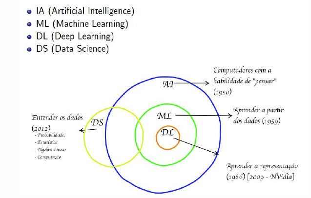
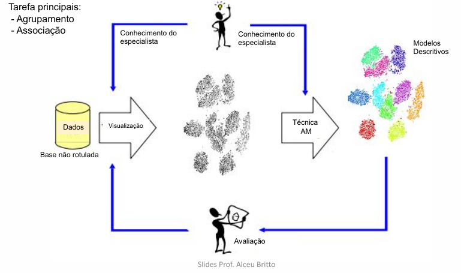
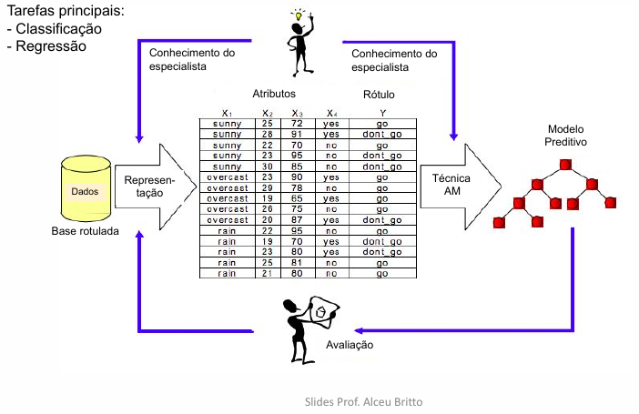
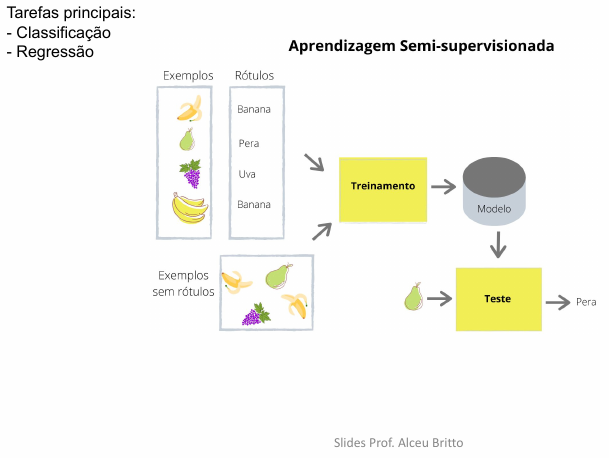

## Aula 1

conteúdo referente a aula do dia 08-03-2022

### Introdução à Aprendizagem de Máquina

Onde se deseja chegar?

* Criação de soluções inteligentes autônomas
  * Resolvem qualquer problema
  * Aprendem sozinhas
  * Sentem emoções
* Estado da arte
  * há soluções que já superam o ser humano em tarefas específicas em diferentes áreas.

#### Temas importantes na Área de I.A.

* Aprendizagem de Máquina
* Processamento de linguagem Natural
* Mineração de Dados
* Reconhecimento de Padrões
* Visão Computacional
* Sistemas de Agentes
* Robótica

#### Temas Emergentes

* Análise de Grandes Volumes de Dados (*Big Data Analytics*)
* Aprendizagem Profunda (*Deep Learning*)
* Ciência de Dados (*Data Science*)

#### Qual a relação entre estes temas

#### Do que se trata Aprendizagem de Máquina

É um ramo da Inteligência Artificial que proporciona a solução de um problema por meio de amostras/exemplos de *dados*. Necessita de mínima intervenção hunama, utiliza de *Técnicas de Indução*. 

Modelos Cognitivos -> Dados transformados em conhecimento.

#### Quais as abordagens

* **Não supervisionada**: Não requer dados rotulados

* **Supervisionada**: requer dados rotulados

* **Semi-supervisionada**: alternativa quando não temos dados torulados em quantidade suficiente

* **Por reforço**: não precisa de dados de treinamento

#### Impactos positivos na sociedade

* Setor de Transportes: Veículos autônomos
* Setor do comércio/Serviços: chatbots/Robôs
* Educação: Ensino customizado para cada aluno
* Agricultura: uso da precisão no cultivo
* Empreendedorismo: start-ups têm como base inovações usando I.A.

Efeitos colaterias na sociedade

* Éticos e morais (*Social credit System*)
* Desemprego
