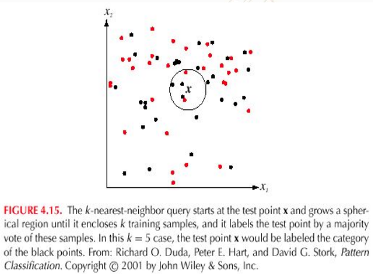
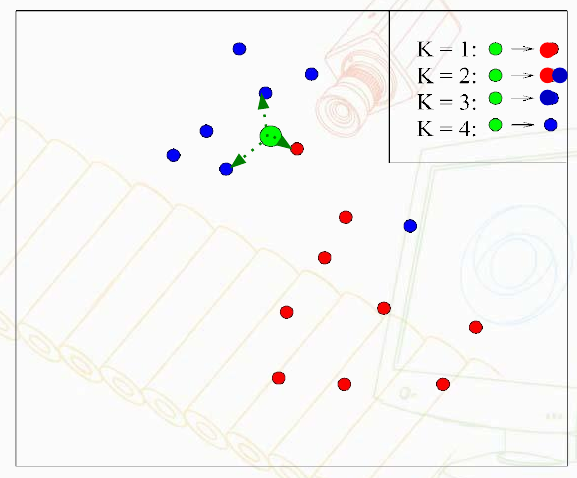

## Aula 2 - Aprendizagem de Máquina

* Supervisionada
* Não-supervisionada
* Semi-supervisionada
* Por Reforço

### Supervisionada

* Classificação
* Regressão

#### Aprendizagem k-NN

k Nearest Neighbor

Métodos de aprendizagem baseados em instâncias assumem que as instâncias podem ser representadas como pontos em um espaço Euclidiano. Esta métodologia consiste somente em armazenar os exemplos de treinamento. Após a aprendizagem encontrar o valor do conceito do alvo (classe) associado a uma instância de testes, um conjunto de instâncias similares são buscadas na memória e utilizadas para classificar a nova instância. Ao final teremos um conjunto de distâncias (medida de similaridade) entre a distância de teste $X_t$ e todas as instâncias de treinamento $X_1,X_2,...,X_n$.

Qual o valor de conceito alvo (classe) atribuímos a instância $X_t$?

*O conteico alvo associado ao exemplo de treinamento mais similar.*

**Regra k-NN**

A regra dos vizinhos mais próximos.

Objetivo: Classificar $X_t$ atribuindo a ele o rótulo representado mais frequente dentre as *k* amostras mais próximas e utilizando um esquema de votação.

A distância Euclidiana entre duas instãncias $X_i$ e $X_j$ é definida como $d(X_i,X_j)$, onde:

$$\displaystyle d(X_i,X_j)\equiv\sqrt{\sum^{n}_{r=1}(a_r(X_i)-a_r(X_j))^2}$$





##### k-NN com Distância Ponderada

É um refinamento do k-NN, em que ponderar a contribuição de cada um dos *k-vizinhos* de acordo com suas distãncias até o ponto $X_t$ que queremos classificar, dando maior peso aos vizinhos mais próximos.

Podemos Ponderar o voto de cada vizinho, de acordo com: 

$\displaystyle 
f(X_t) \leftarrow \argmax_{c \in C}\sum^{k}_{i=1}w_i\delta(c,f(x_i))$

$w_i\equiv\frac{1}{d(X_t,X-i)^2}$ 

porém se $X_t=X_i$ o denominador $d(X_t,X_i)^2$ torna-se zero. Neste caso fazemos $f(X_t) = f(X_i)$

#### Exercícios

* Atividade 1: Avaliar os parâmetros do kNN
  * Variar o valor de K: melhor número para a base utilizada: 3
  * testar o uso de peso: para a base utilizada não teve diferença entre utilizar `uniform` e `distance`
  * testar o uso de ball_tree: `kd_tree` objetve um melhor resultado
  * Ao aumentar o número de folders para 100 pastas, com utilização de cross-validation, a acurácia aumentou para 0.9883.
  * Ao alterar o número de folhas não obteve melhora no resultado para ambos algoritmos (kd_tree,ball_tree)
```python
clf = KNeighborsClassifier(n_neighbors=3,weights='uniform',algorithm='kd_tree',leaf_size=30)
T=100
result = model_selection.cross_val_score(clf, X, y, cv=T)
```
* Atividade 2: Programar seu kNN 
