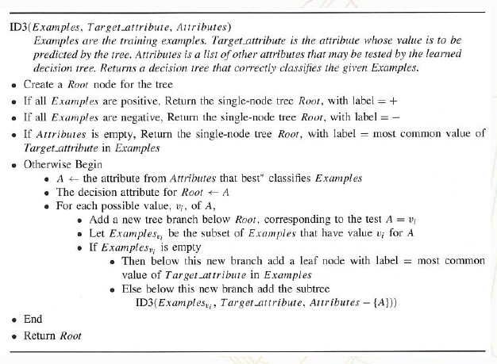
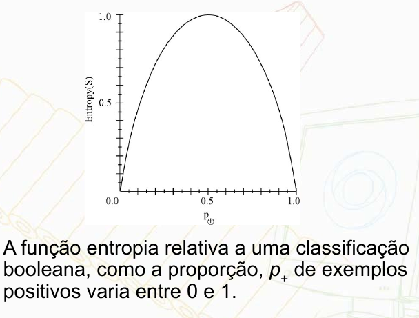
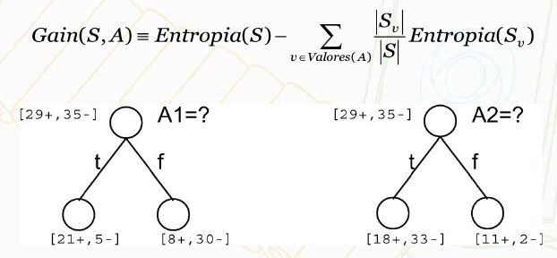
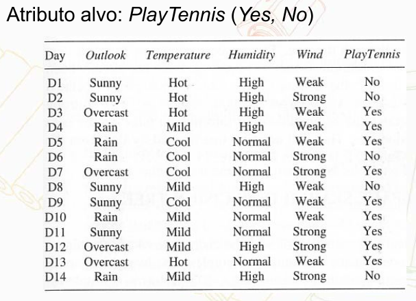
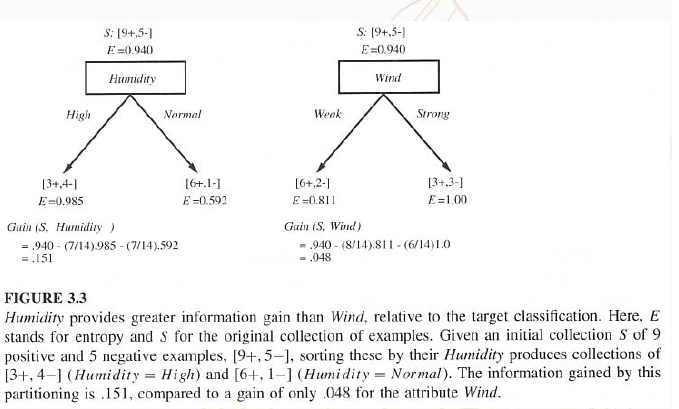
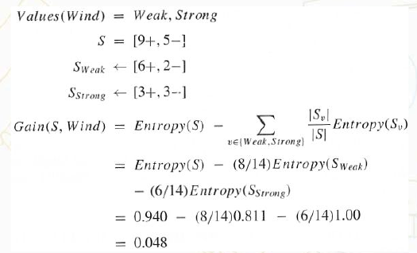
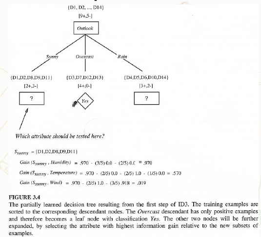
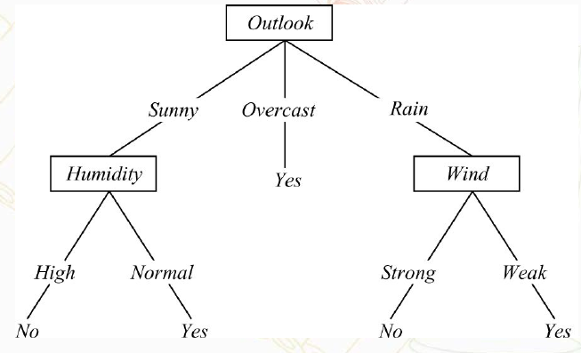
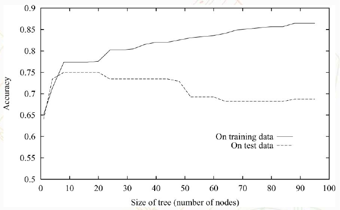

## Aula 3 - Árvores de Decisão e Regressão

### Representação de árvores de decisão

Uma instância é classificada inicialmente pelo **nó raiz**, testando o atributo especificado por este nó. Em seguida movendo-se através do ramo correspondendo ao valor do atributo no exemplo dado. Este processo é repetido para a sub-árvore originada do novo nó.

### Algoritmo básico para aprendizagem de árvores de decisão

* Algoritmo Base: ID3, seu sucessoe é o C4.5

O algoritmo ID3 "aprende" árvores de decisão construindo-as de cima para baixo, começando com a questão:

*Qual atributo deve ser testado na raiz da árvore?*

Para responder a esta questão, cada atributo da instância é avaliado usando um teste estatístico para determinar quão bem ele sozinho classifica os exemplos de treinamento.

**Escolha Central**: Selecionar qual atributo testar em cada nó da árvore.

Devemos Selecionar o atributo maus útil para classificar os exemplos, mas como sabemos qual é o mais útil?

Medida quantativa: Ganho de Informação = mede quão bem um atributo separa os exemplos de treinamento de acordo com a classificação alvo.

### Entropia

Caracteriza a impureza de uma coleção arbitrária de exemplos. Dada uma coleção **S** contendo exemplos positivos e negativos de algum conceito alvo, a entropia de **S** relativa a esta classificação booleana é:

$$\displaystyle Entropia(S) \equiv -p_+ log_2 p_+ - p_- log_2 p_-$$

* $p_+$ é a proporção de exemplos positivos em **S**
* $p_-$ é a proporção de exemplos negativos em **S**

Generalizando para o caso de um atributo alvo aceitar *c* diferentes valores, a entropia de **S** relativa a esta classificação *c-classes* é definida como:

$$\displaystyle Entropia(S) \equiv \sum^{c}_ {i=1} - p_i log_2 p_i$$

onde $p$ é a proporção de **S** pertencendo a classe $i$

**Ganho de informação**: $Gain(S,A)$ é a redução esperada na entropia devido a ordenação sobre $A$, ou seja, a redução esperada na entropia causada pela participação dos exemplos de acordo com este atributo $A$.

#### Tarefa de aprendizagem

Exemplo Ilustrativo

O atributo *PlayTenis* indica se u jogo ou não tênis naquele dia.

*Qual é a tarefa de aprendizagem?*

Aprender a predizer o vaore de *PlayTenis* para um dia qualquer baseando-se apenas nos valores dos outros atributos.

* Primeiro Passo: 
  * criação do nó superior da árvore de decisão. *Qual atributo deve ser testado primeiro na árvore?*
  * Determinar o ganho de informação(*Gain*) para cada atributo candidato
  * Selecionar aquele cujo ganho de informação é o mais alto.
* Entropia
  * Exemplo: *Sendo **S** uma coleção ed 14 exemplos de algum conceito booleano, incluindo 9 exemplos positivos e 5 negativos\[9+,5-\]* 
  * A entropia de **S** relativa a classificação booleana é: $Entropia([9+,5-])=-\frac{9}{14} log_2 \frac{9}{14} - \frac{5}{14} log_2 \frac{5}{14} = 0.940$

Ganho de Informação: **S** é uma coleção de exemplos de treinamento descritos por atributos incluindo (*Wind*). Temos ao todo 14 exemplos:

Exemplo:
* Gain(S,Outlook)=0.246
* Gain(S,Humidity)=0.151
* Gain(S,Wind) = 0.048
* Gain(S,Temperature)=0.029

Ou seja o atributo *Outlook* fornece a melhor predição do atributo alvo, *PlayTenis*, sobre os exemplos de treinamento

**Árvore de decisão final**

##### Evitando sobreajuste

**Sobre ajuste no trinamento de árvores de decisão**

* Podar um nó de decisão: Consiste em remover a sub-árvore enraizada naquele nó, tornando-o um nó folha
* Atribuir a este nó a classificação mais comum dos exemplos de treinamento afiliados com aquele nó.
* Nós são removidos somente se a árvore aparada resultante não apresenta um comportamento pior do que a original sobre o conjunto de validação.

#### Atributos de Valor contínuo

Na definição da ID3 temos as restrições:

* Atributo alvo deve ter valor discreto
* Os atriutos testados nos nós de decisão devem também ser de valor discreto

A segunda restrição pode ser removida
* Denifir dinamicamente novos atributos de valor discreto que particionam o valor do atributo contínuo em um conjunto discreto de intervalos.
* **A**= Atributo de valor contínuo -> criar um novo atributo $A_c$ que é verdadeiro se $A \lt c$ e falso caso contrário.

Como identificar o limiar *c*?: Valor que produza o maior ganho de informações

### Árvores (Prós)

* Simplicidade para compreensão e interpretação: árvores de decisão são facilmente compreendidas após uma breve explicação
* Os dados não necessitam de pré-processamento: outras técnicas normalmente exigem normalização de dados.
* Lidam tanto com dados numéricos quanto categóricos: outras técnicas normalmente lidam somente com um único tipo de variável
* Emprega um modelo "caixa-branca": se uma dada situação é observável em um modelo, a explicação para a condição é facilmente feita através da lógica booleana.
* Possibilidade de validar um modelo através de testes estáticos: é possível avaliar a confiabilidade do modelo
* Robustez: bom desempenho mesmo se as suposições iniciais do modelo de dados forem violadas
* Bom desempenho em grandes conjuntos de dados em um tempo curto: grandes quantidades de dados podem ser analisados utilizando recursos computacionais comuns

### Árvores (Contras/Limitações)

* O problema deve aprender uma árvore de decisão ótima é NP-Completo: os algoritmos práticos de aprendizagem de árvore de decis
* ão são baseados em heurísticas onde decisões ótimas locais são tomadas em cada nó.
* O aprendizado de árvores de decisão pode criar árvores muito complexas que não generalizam bem os dados: *sobreajuste*, mecanismos de poda são necessários para evitar *sobreajuste*(*Overfitting*)
* Alguns conceitos são difícies de serem aprendidos, pois árvores de decisão não expressa-os facilmente: problemas XOR, paridade e multiplexador. Nestes casos as árvores de decisão se tornam poibitivamente grandes.
* Para dados com variáveis caregóricas, com diferentes níveis, o ganho de informação é tendencioso em favor daqueles atributos que possuem mais níveis.